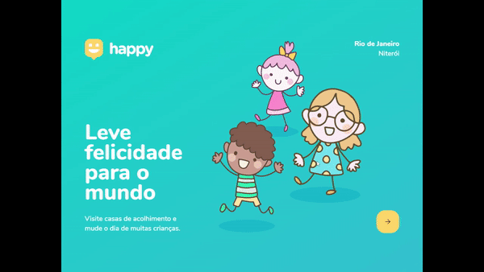

  

## 🚀 Tecnologias

Esse projeto foi desenvolvido utilizando as seguintes tecnologias:

- [Node.js](https://nodejs.org/en/)
- [Express](https://expressjs.com/pt-br/)
- [SQLite](https://www.sqlite.org/index.html)
- [handlebars](https://handlebarsjs.com/)

## 🚀 Desafios 2.0 realizado

Essa é a lista dos desafios realizados até o momento

- [x]  Layout da aplicação
- [x]  Acesso Restrito
- [ ]  Recuperação de senhas
- [x]  Cadastro de orfanatos
- [ ]  Splash screen no react native com expo
- [ ]  OnBoarding do usuário
- [x]  Localização real do usuário
- [ ]  Cadastro em múltiplas etapas
- [x]  Logout da aplicação
- [ ]  Deploy da aplicação

## 💻 Projeto

O Happy é um projeto que visa facilitar visitas aos orfanatos próximos a você 💜 

Este é um projeto desenvolvido durante a **[Next Level Week](https://nextlevelweek.com/)**, realizada pela **[@Rocketseat](https://github.com/Rocketseat)** durante os dias 12 a 18 de Outubro de 2020.

Desenvolvido por Douglas Carvalho

